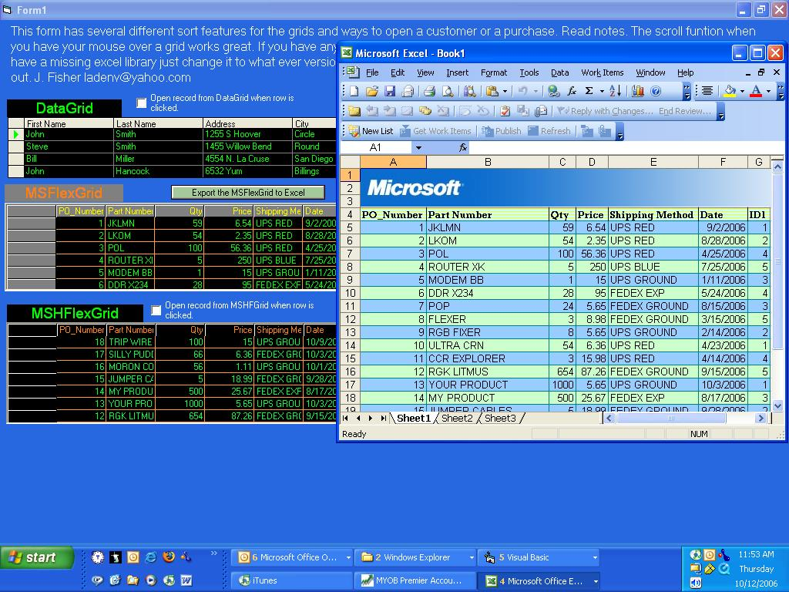



## MSFlexgrid, MSHFlexGrid, DataGrid sort, scroll on mouseover, export to exce

### Description

This a small program that shows how to sort in all of the grids. It also will scroll with the mouse wheel when you mouse is over the grid what ever version you are using. You can also export to excel the information from the MSFlexgrid. Use excel 11.0 object library. Just referernce what ever version of excel and office library you have on your computer. You must have excel for this function to work. Updated 10/12/06 Alternating row colors in Excel. Auto fit columns in excel.
 
### More Info
 
The project will close if there is an error. Just make sure you save if you use this in another project.

             |
---                |---
**Submitted On**   |2006-10-17 15:39:06
**By**             |[Joe Fisher](https://github.com/Planet-Source-Code/PSCIndex/blob/master/ByAuthor/joe-fisher.md)
**Level**          |Intermediate
**User Rating**    |4.6 (32 globes from 7 users)
**Compatibility**  |VB 6\.0
**Category**       |[Custom Controls/ Forms/  Menus](https://github.com/Planet-Source-Code/PSCIndex/blob/master/ByCategory/custom-controls-forms-menus__1-4.md)
**World**          |[Visual Basic](https://github.com/Planet-Source-Code/PSCIndex/blob/master/ByWorld/visual-basic.md)
**Archive File**   |[MSFlexgrid20255610172006\.zip](https://github.com/Planet-Source-Code/joe-fisher-msflexgrid-mshflexgrid-datagrid-sort-scroll-on-mouseover-export-to-exce__1-66743/archive/master.zip)

